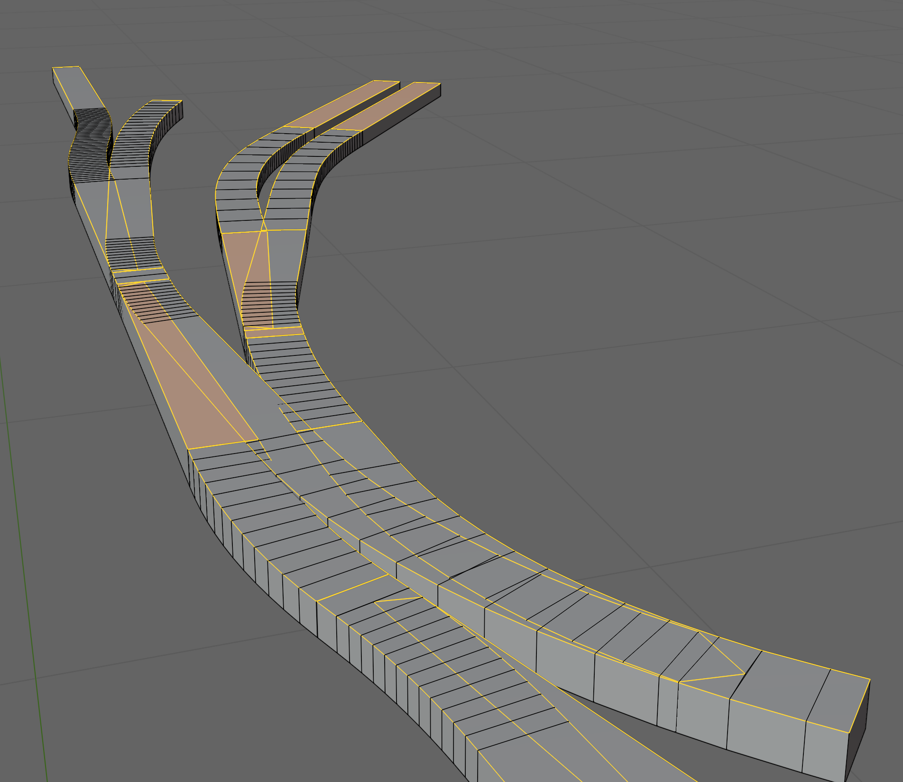

# Edge selection algorithm

## Assumptions

1. Frog corners have had the edges split so there is a vertex at the corner. 
In fact there should be two sharing the same coordinates. 
This is left that way in order to terminate the walk.
If they were joined it would be hard to determine how the walk should continue.

1. The ordering and adjacency is only important for finding the edges, not for selecting them or for beveling

1. Native methods don't exist in Blender.  Selecting all the top faces then `Select->Select Loops -> Boundary Loops - Select Boundary Loop` looked promising, but it included some of the interior edges:

## Functions

### Classify linked edges for a vertex on an edge

1. Remove edges that have a zero for z, so we are left with edges on the top. 
1. For all edges convert to unit vectors with origin 0,0,0
1. Determine pairwise combinations that include the anchor edge
1. For each pair compute the "dot" product
1. If there is only one pair:
    1. If the dot product is close to 0 then assign one to perpendicular and the other to colinear
    1. If the dot product is close to 1 then assign both to colinear 
    1. Otherwise one to colinear and 1 to neither
1. Otherwise:
    1. Those with dot product close to 1 or -1 go in colinear
    1. Those with a dot product close to 0 go in perpendicular
    1. Anything else goes in neither

## Main

### Steps

1. Set up an empty set of chains
1. Loop through all end faces
    1. Initialize a new chain
    1. Get the edge on top of the end face.
    1. loop through its vertices to start walks in each direction
        1. Walk down the connected links:
            1. Is this a frog vertex?
                1. Yes: terminate chain
            1. Else: Classify the links for the vertex

                1. If there a colinear path: follow that
                2. Else: if there is a perpendicular path: follow that
                3. If neither: terminate chaine

1. Put all the edges from all chains into a set
1. From that set remove the end face edges

    
